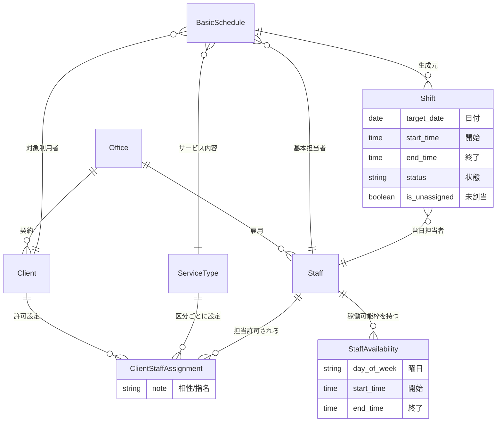

# 🧩 ドメイン論理エンティティ定義書 (MVP Phase 1)

## 1. 概要

本ドキュメントは、訪問介護シフト管理プロダクト（MVP）におけるデータの論理構造を定義するものである。
**「基本スケジュールの型」**と**「日々のシフト実績」**を分離し、**「担当許可リスト（ホワイトリスト）」**によって安全なアサインを保証する構造とする。

---

## 2. エンティティ詳細定義

### A. 組織・スタッフ管理 (Organization & Staff)

システムの利用主体と、その稼働条件を管理する。

| エンティティ名     | 英語名              | 役割・定義                                                                                    | 主要属性 (Attributes)                                                                                                                  |
| :----------------- | :------------------ | :-------------------------------------------------------------------------------------------- | :------------------------------------------------------------------------------------------------------------------------------------- |
| **事業所**         | `Office`            | データのテナント単位。全てのデータはこの事業所に属する。                                      | ・事業所 ID (PK) ・事業所名                                                                                                         |
| **スタッフ**       | `Staff`             | 管理者およびヘルパー。Supabase Auth のユーザー情報と紐づくプロフィール。                      | ・スタッフ ID (PK) ・氏名 ・権限ロール (Admin/Helper) ・連絡先                                                                |
| **稼働可能シフト** | `StaffAvailability` | スタッフが稼働可能な「曜日」と「時間枠」。AI 最適化のための基礎データとなる**構造化データ**。 | ・ID (PK) ・スタッフ ID (FK) ・**曜日** (Mon, Tue...) ・**開始時刻** (HH:mm) ・**終了時刻** (HH:mm) ・優先度 (High/Low) |

### B. サービス・利用者・アサイン制御 (Service & Client)

提供するサービスと、それを受けられるスタッフの適合性（ホワイトリスト）を管理する。

| エンティティ名     | 英語名                  | 役割・定義                                                                                                                                            | 主要属性 (Attributes)                                                                                                  |
| :----------------- | :---------------------- | :---------------------------------------------------------------------------------------------------------------------------------------------------- | :--------------------------------------------------------------------------------------------------------------------- |
| **サービス区分**   | `ServiceType`           | 提供する介護メニューのマスタ。 MVP では**「身体介護」「生活支援」「通院サポート」**の 3 種とする。                                                 | ・サービス区分 ID (PK) ・名称 ・表示順序                                                                         |
| **利用者**         | `Client`                | サービスを受ける契約者。                                                                                                                              | ・利用者 ID (PK) ・氏名 ・住所 (訪問先)                                                                          |
| **担当許可リスト** | `ClientStaffAssignment` | **【重要】** 特定の利用者の、特定のサービスに対して、担当可能なスタッフを定義する**ホワイトリスト**。ここにレコードがないスタッフはアサインできない。 | ・ID (PK) ・**利用者 ID** (FK) ・**サービス区分 ID** (FK) ・**スタッフ ID** (FK) ・備考 (相性良, 指名など) |

### C. スケジュール・シフト (Schedule & Shift)

「予定のパターン」と「個別の実績」を分離して管理する。

| エンティティ名       | 英語名          | 役割・定義                                                                                                                     | 主要属性 (Attributes)                                                                                                                                                    |
| :------------------- | :-------------- | :----------------------------------------------------------------------------------------------------------------------------- | :----------------------------------------------------------------------------------------------------------------------------------------------------------------------- |
| **基本スケジュール** | `BasicSchedule` | 半年単位などで決まっている**繰り返しの週間スケジュール**。ここを変更しても過去の実績には影響しない。                           | ・基本予定 ID (PK) ・曜日 ・開始/終了時刻 ・利用者 ID (FK) ・サービス区分 ID (FK) ・**デフォルト担当スタッフ ID** (FK)                                    |
| **シフト（実体）**   | `Shift`         | 基本スケジュールから生成された、**特定の日付の実績データ**。日々の変更、キャンセル、担当者変更はこのエンティティに対して行う。 | ・シフト ID (PK) ・**日付** (Date) ・開始/終了時刻 ・ステータス (予定/確定/完了/キャンセル) ・**担当スタッフ ID** (FK, Nullable) ・未割当フラグ (Boolean) |

#### 時間の重複について

- 訪問介護では、ヘルパーの移動の時間を考慮する必要がある。
- スケージュールの間は、少なくとも 30分 のインターバルが必要。
- スケージュールの重複を計算する場合は スケージュールに 30分 を追加して考えること。

---

## 3. エンティティ関係図 (ER Diagram)

上記の構造を Mermaid 記法で可視化する。

