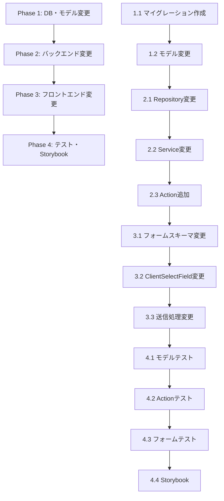

# Issue #18: 基本スケジュールでの新規利用者登録 - 実装計画

## 概要

# contractStatus: "suspended",\

"計画書を作成しました: Docs/tasks/plan-2026-02-07-14-00.md"

| 項目     | 内容                                                                                  |
| -------- | ------------------------------------------------------------------------------------- |
| Issue    | [#18 基本スケジュールでの新規利用者登録](https://github.com/ebi311/rhubarb/issues/18) |
| 作成日   | 2026-02-08                                                                            |
| ブランチ | `feature/issue-18-new-client-registration`                                            |

## 変更対象ファイル一覧

### 1. データベース層

| ファイル                                                               | 変更内容                                   |
| ---------------------------------------------------------------------- | ------------------------------------------ |
| `supabase/migrations/{timestamp}_allow_null_client_address.sql` (新規) | `clients.address` カラムを NULL 許可に変更 |

### 2. モデル層

| ファイル                                                     | 変更内容                                                 |
| ------------------------------------------------------------ | -------------------------------------------------------- |
| [src/models/serviceUser.ts](../../src/models/serviceUser.ts) | `address` を `.nullable().optional()` に変更             |
| [src/models/serviceUser.ts](../../src/models/serviceUser.ts) | `ServiceUserInputSchema.address` を `.optional()` に変更 |

### 3. バックエンド層

| ファイル                                                                                                     | 変更内容                                           |
| ------------------------------------------------------------------------------------------------------------ | -------------------------------------------------- |
| [src/backend/repositories/serviceUserRepository.ts](../../src/backend/repositories/serviceUserRepository.ts) | `create()` で `address: null` を許可               |
| [src/backend/services/serviceUserService.ts](../../src/backend/services/serviceUserService.ts)               | 簡易作成メソッド `createQuickServiceUser()` を追加 |
| [src/app/actions/serviceUsers.ts](../../src/app/actions/serviceUsers.ts)                                     | `createQuickServiceUserAction()` を追加            |

### 4. フロントエンド層（BasicScheduleForm）

| ファイル                                                                                                                                                                                      | 変更内容                                                                                |
| --------------------------------------------------------------------------------------------------------------------------------------------------------------------------------------------- | --------------------------------------------------------------------------------------- |
| [src/app/admin/basic-schedules/\_components/BasicScheduleForm/BasicScheduleForm.tsx](../../src/app/admin/basic-schedules/_components/BasicScheduleForm/BasicScheduleForm.tsx)                 | フォームスキーマに `newClientName` フィールド追加、`clientId` を `uuid \| 'new'` に変更 |
| [src/app/admin/basic-schedules/\_components/BasicScheduleForm/FormControls.tsx](../../src/app/admin/basic-schedules/_components/BasicScheduleForm/FormControls.tsx)                           | `ClientSelectField` に「新規利用者」オプションと氏名入力フィールド追加                  |
| [src/app/admin/basic-schedules/\_components/BasicScheduleForm/useBasicScheduleFormSubmit.ts](../../src/app/admin/basic-schedules/_components/BasicScheduleForm/useBasicScheduleFormSubmit.ts) | `clientId === 'new'` 時に利用者作成→スケジュール登録の2段階処理                         |

### 5. テスト・Storybook

| ファイル                                                                                                                                                                                      | 変更内容                                                             |
| --------------------------------------------------------------------------------------------------------------------------------------------------------------------------------------------- | -------------------------------------------------------------------- |
| [src/models/serviceUser.test.ts](../../src/models/serviceUser.test.ts) (新規)                                                                                                                 | モデルバリデーションテスト（address が null 許可になったことの検証） |
| [src/app/actions/serviceUsers.test.ts](../../src/app/actions/serviceUsers.test.ts)                                                                                                            | `createQuickServiceUserAction` のテスト追加                          |
| [src/app/admin/basic-schedules/\_components/BasicScheduleForm/BasicScheduleForm.test.tsx](../../src/app/admin/basic-schedules/_components/BasicScheduleForm/BasicScheduleForm.test.tsx)       | 新規利用者登録フローのテスト追加                                     |
| [src/app/admin/basic-schedules/\_components/BasicScheduleForm/BasicScheduleForm.stories.tsx](../../src/app/admin/basic-schedules/_components/BasicScheduleForm/BasicScheduleForm.stories.tsx) | 「新規利用者選択時」のストーリー追加                                 |

---

## 実装詳細

### Phase 1: データベース・モデル変更

#### 1.1 マイグレーション作成

```sql
-- supabase/migrations/{timestamp}_allow_null_client_address.sql
ALTER TABLE public.clients ALTER COLUMN address DROP NOT NULL;
```

#### 1.2 ServiceUserSchema 変更

```typescript
// src/models/serviceUser.ts
export const ServiceUserSchema = z.object({
	id: z.uuid(),
	office_id: z.uuid(),
	name: z.string().min(1, { message: '氏名は必須です' }),
	address: z.string().nullable().optional(), // 変更
	contract_status: ContractStatusSchema,
	created_at: TimestampSchema,
	updated_at: TimestampSchema,
});

export const ServiceUserInputSchema = z.object({
	name: z
		.string()
		.min(1, '氏名は必須です')
		.max(100, '氏名は100文字以内で入力してください')
		.refine((val) => val.trim().length > 0, '氏名に空白のみは使用できません'),
	address: z
		.string()
		.max(200, '住所は200文字以内で入力してください')
		.refine(
			(val) => !val || val.trim().length > 0,
			'住所に空白のみは使用できません',
		)
		.optional(), // 変更
	contract_status: ContractStatusSchema.optional(),
});
```

### Phase 2: バックエンド変更

#### 2.1 Repository 変更

```typescript
// src/backend/repositories/serviceUserRepository.ts
async create(data: {
  office_id: string;
  name: string;
  address?: string | null;  // 変更
}): Promise<ServiceUser> {
  const insertData: ServiceUserInsert = {
    office_id: data.office_id,
    name: data.name,
    address: data.address ?? null,  // 変更
    contract_status: 'active',
  };
  // ...
}
```

#### 2.2 Service に簡易作成メソッド追加

```typescript
// src/backend/services/serviceUserService.ts
async createQuickServiceUser(
  userId: string,
  name: string,
): Promise<ServiceUser> {
  const staff = await this.getAdminStaff(userId);
  const trimmedName = name.trim();
  if (!trimmedName || trimmedName.length > 100) {
    throw new ServiceError(400, '氏名は1〜100文字で入力してください');
  }

  return this.serviceUserRepository.create({
    office_id: staff.office_id,
    name: trimmedName,
    address: null,
  });
}
```

#### 2.3 Server Action 追加

```typescript
// src/app/actions/serviceUsers.ts
export const createQuickServiceUserAction = async (
	name: string,
): Promise<ActionResult<ServiceUser>> => {
	const supabase = await createSupabaseClient();
	const {
		data: { user },
		error: authError,
	} = await supabase.auth.getUser();
	if (authError || !user) return errorResult('Unauthorized', 401);

	const service = new ServiceUserService(supabase);
	try {
		const serviceUser = await service.createQuickServiceUser(user.id, name);
		return successResult(serviceUser, 201);
	} catch (e) {
		if (e instanceof ServiceError) {
			return errorResult(e.message, e.status, e.details);
		}
		throw e;
	}
};
```

### Phase 3: フロントエンド変更

#### 3.1 フォームスキーマ変更 (BasicScheduleForm.tsx)

```typescript
const BasicScheduleFormSchema = z
	.object({
		clientId: z.uuid().or(z.literal('new')), // 変更
		newClientName: z.string().optional(), // 追加
		serviceTypeId: ServiceTypeIdSchema.or(z.literal('')),
		weekday: WeekdaySchema,
		startTime: z
			.string()
			.min(1, { message: '開始時刻を入力してください' })
			.regex(TIME_PATTERN, '開始時刻はHH:MM形式で入力してください'),
		endTime: z
			.string()
			.min(1, { message: '終了時刻を入力してください' })
			.regex(TIME_PATTERN, '終了時刻はHH:MM形式で入力してください'),
		note: z
			.string()
			.max(500, { message: '備考は500文字以内で入力してください' })
			.optional(),
		staffId: z
			.uuid('担当者IDはUUID形式で指定してください')
			.nullable()
			.optional(),
	})
	.superRefine((values, ctx) => {
		// 新規利用者選択時は氏名必須
		if (values.clientId === 'new') {
			const name = values.newClientName?.trim();
			if (!name) {
				ctx.addIssue({
					code: z.ZodIssueCode.custom,
					path: ['newClientName'],
					message: '新規利用者の氏名を入力してください',
				});
			} else if (name.length > 100) {
				ctx.addIssue({
					code: z.ZodIssueCode.custom,
					path: ['newClientName'],
					message: '氏名は100文字以内で入力してください',
				});
			}
		}
		// 既存のバリデーション...
	});
```

#### 3.2 ClientSelectField 変更 (FormControls.tsx)

```tsx
export const ClientSelectField = ({
	serviceUsers,
	disabled = false,
}: ClientSelectFieldProps) => {
	const fieldId = useId();
	const {
		register,
		watch,
		control,
		formState: { errors, isSubmitting },
	} = useFormContext<BasicScheduleFormValues>();

	const clientId = watch('clientId');
	const isNewClient = clientId === 'new';

	// ...既存のコード...

	return (
		<fieldset className="fieldset">
			<legend id={`${fieldId}-label`} className="fieldset-legend">
				利用者 *
				{disabled && (
					<span className="ml-2 text-xs text-base-content/60">(変更不可)</span>
				)}
			</legend>
			<FormSelect
				id={fieldId}
				className={selectClass}
				disabled={isDisabled}
				aria-labelledby={`${fieldId}-label`}
				aria-invalid={hasError}
				aria-describedby={describedBy}
				options={[
					{ value: '', label: '選択してください' },
					{ value: 'new', label: '➕ 新規利用者を登録' }, // 追加
					...serviceUsers.map((client) => ({
						value: client.id,
						label: client.name,
					})),
				]}
				{...register('clientId')}
			/>
			<FieldErrorMessage fieldId={fieldId} error={errors.clientId} />

			{/* 新規利用者名入力フィールド */}
			{isNewClient && (
				<div className="mt-2">
					<FormInput
						control={control}
						name="newClientName"
						label="新規利用者の氏名"
						placeholder="氏名を入力してください"
						required
						disabled={isSubmitting}
					/>
				</div>
			)}
		</fieldset>
	);
};
```

#### 3.3 送信処理変更 (useBasicScheduleFormSubmit.ts)

```typescript
import { createQuickServiceUserAction } from '@/app/actions/serviceUsers';

// onSubmit 関数内
const onSubmit = async (values: BasicScheduleFormValues) => {
	setApiError(null);

	// 時刻パース等の既存処理...

	let actualClientId = values.clientId;

	// 新規利用者の場合、先に利用者を作成
	if (values.clientId === 'new') {
		if (!values.newClientName?.trim()) {
			setApiError('新規利用者の氏名を入力してください');
			return;
		}

		const createClientResult = await createQuickServiceUserAction(
			values.newClientName.trim(),
		);
		if (createClientResult.error || !createClientResult.data) {
			setApiError(createClientResult.error ?? '利用者の作成に失敗しました');
			return;
		}
		actualClientId = createClientResult.data.id;
	}

	const payload = {
		client_id: actualClientId,
		service_type_id: values.serviceTypeId,
		weekday: values.weekday,
		start_time: start,
		end_time: end,
		staff_ids: values.staffId ? [values.staffId] : [],
		note: sanitizeNote(values.note),
	};

	// 以降は既存の処理...
};
```

---

## 実装順序

#"計画書を作成しました: docs/tasks/plan-2026-02-07-14-00.md""計画書を作成しました: docs/tasks/plan-2026-02-07-14-00.md"
contractStatus: "suspended",\



### タスク一覧

| #   | タスク                            | 対象ファイル                                        | 依存 |
| --- | --------------------------------- | --------------------------------------------------- | ---- |
| 1   | マイグレーション作成・適用        | `supabase/migrations/`                              | -    |
| 2   | ServiceUserSchema 変更            | `src/models/serviceUser.ts`                         | 1    |
| 3   | Repository 変更                   | `src/backend/repositories/serviceUserRepository.ts` | 2    |
| 4   | Service に簡易作成メソッド追加    | `src/backend/services/serviceUserService.ts`        | 3    |
| 5   | createQuickServiceUserAction 追加 | `src/app/actions/serviceUsers.ts`                   | 4    |
| 6   | フォームスキーマ変更              | `BasicScheduleForm.tsx`                             | 5    |
| 7   | ClientSelectField 変更            | `FormControls.tsx`                                  | 6    |
| 8   | 送信処理変更                      | `useBasicScheduleFormSubmit.ts`                     | 7    |
| 9   | モデルテスト作成・更新            | `serviceUser.test.ts`                               | 2    |
| 10  | Actionテスト更新                  | `serviceUsers.test.ts`                              | 5    |
| 11  | フォームテスト更新                | `BasicScheduleForm.test.tsx`                        | 8    |
| 12  | Storybook ストーリー追加          | `BasicScheduleForm.stories.tsx`                     | 8    |

---

## テスト計画

### ユニットテスト

#### モデルテスト (`src/models/serviceUser.test.ts`)

- [ ] `ServiceUserSchema` が `address: null` を許容すること
- [ ] `ServiceUserInputSchema` が `address` なしで valid になること
- [ ] 既存のバリデーション（name 必須など）が維持されていること

#### Action テスト (`src/app/actions/serviceUsers.test.ts`)

- [ ] `createQuickServiceUserAction` が名前のみで利用者を作成できること
- [ ] `createQuickServiceUserAction` が空の名前でエラーを返すこと
- [ ] `createQuickServiceUserAction` が100文字超でエラーを返すこと
- [ ] 認証エラー時に 401 を返すこと

#### フォームテスト (`BasicScheduleForm.test.tsx`)

- [ ] 「新規利用者」選択時に氏名入力フィールドが表示されること
- [ ] 既存利用者選択時に氏名入力フィールドが非表示であること
- [ ] 新規利用者選択時、氏名未入力で登録ボタンが無効であること
- [ ] 新規利用者登録フローで `createQuickServiceUserAction` → `createBasicScheduleAction` が呼ばれること
- [ ] 編集モードでは「新規利用者」オプションが表示されないこと（要確認）

### Storybook

#### 追加ストーリー

- [ ] `NewClientSelected` - 新規利用者が選択された状態
- [ ] `NewClientWithName` - 新規利用者名が入力された状態

---

## 確認事項（実装前に決定が必要）

| #   | 確認事項                                             | 推奨回答                                                      |
| --- | ---------------------------------------------------- | ------------------------------------------------------------- |
| 1   | 新規利用者の `contract_status` は `active` 固定でOK? | ✅ Yes（簡易登録のため）                                      |
| 2   | 編集モードでも新規利用者登録を可能にする?            | ❌ No（現在編集モードでは利用者変更不可のため、整合性を保つ） |

---

## 見積もり

| Phase                       | 工数目安 |
| --------------------------- | -------- |
| Phase 1: DB・モデル変更     | 0.5h     |
| Phase 2: バックエンド変更   | 1h       |
| Phase 3: フロントエンド変更 | 2h       |
| Phase 4: テスト・Storybook  | 2h       |
| **合計**                    | **5.5h** |
